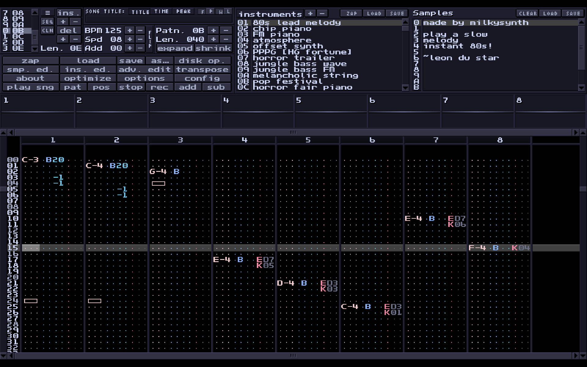
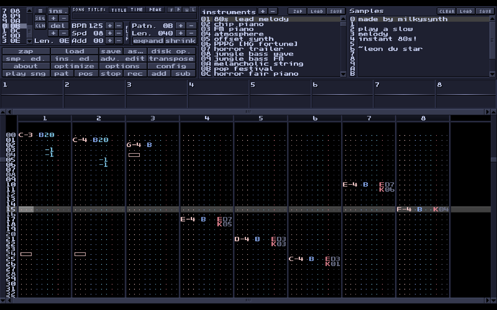
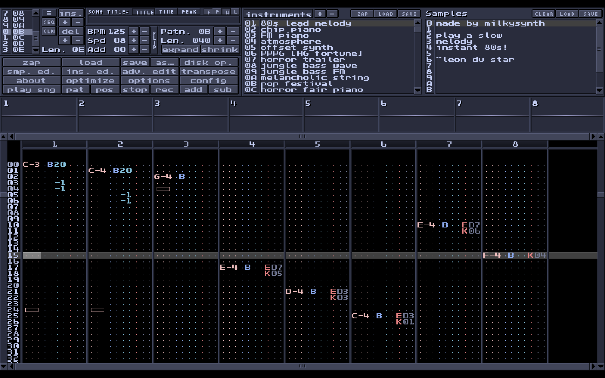
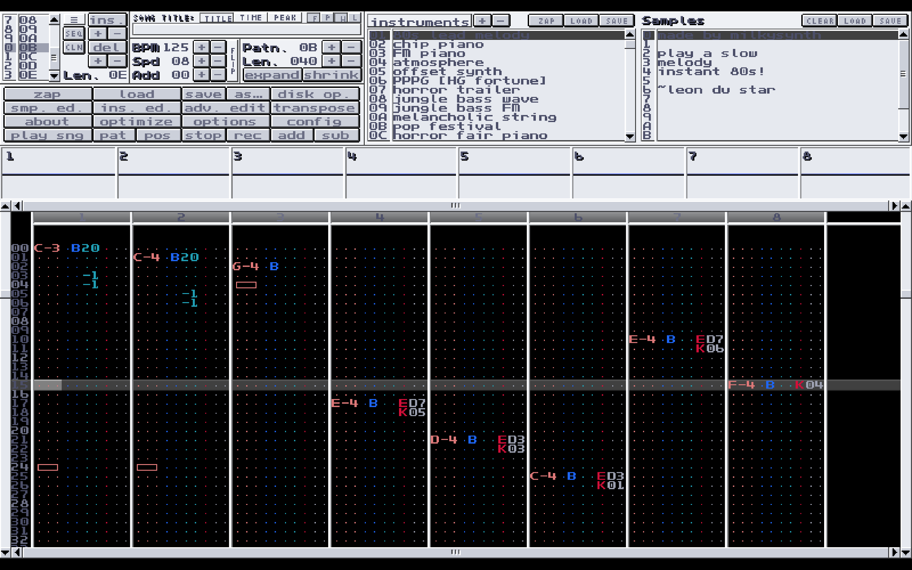

> [!WARNING]
> A couple of options are incomplete (set to #FF0000, bright red), cause I can't find it in MilkyTracker, thus idk what colors are suited.

# Catppuccin Mocha theme for MilkyTracker
An inofficial port of the [Catppuccin](https://catppuccin.com) colorscheme for [MilkyTracker](https://milkytracker.org).

## Import
- **Config** > **layout** > <u>Colors</u> > **[I]** (import)
- Click **apply**

## [template.mct](template.mct)
This file visualizes what exact colors I chose from the [official palette](https://catppuccin.com/palette). To make your own spin, replace the color names in the square brackets, then replace them (with the square brackets) to the respective hex code. It must be ALL-CAPS and have no leading #.

_Mocha_

_Macchiato_

_Frappé_

_Latte_
